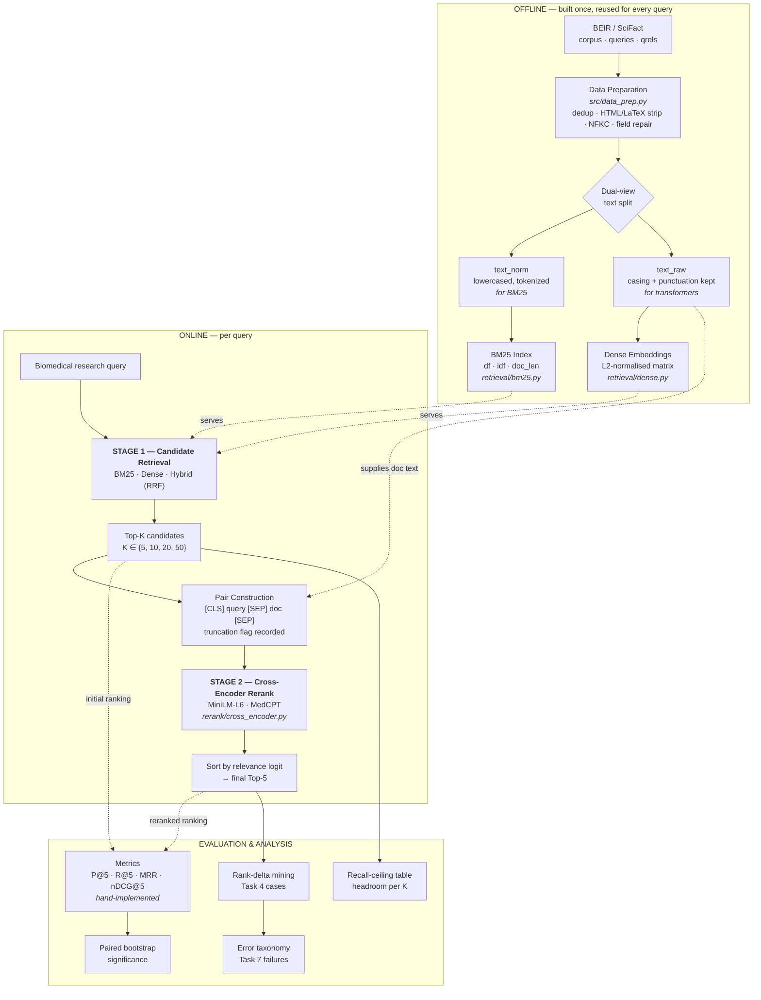
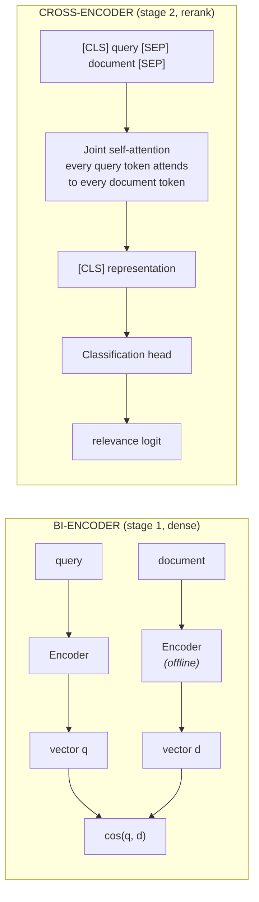

# System Architecture — Cross-Encoder Reranking for Biomedical Literature Retrieval

**EC-1 Assessment, Conversational AI (AIMLCZG521) — Problem Statement 2**

This document specifies the architectural design, data flow, component contracts, and
design rationale for the two-stage retrieval system. It is the reference that
`report.md` §Architecture and the notebook's architecture section both draw from.

> **Scope statement.** This system performs *biomedical literature retrieval* —
> ranking research abstracts by relevance to a research query. It does **not**
> provide medical diagnosis, treatment recommendations, or patient-specific
> medical advice, and must not be used for those purposes.

---

## 1. Design premise: why two stages at all

A single-stage system must choose between two things it cannot have together:

| | Fast lexical / bi-encoder retrieval | Cross-encoder scoring |
|---|---|---|
| Query–document interaction | None (independent representations) | Full token-level attention |
| Document representation | Precomputable offline | Must be computed per query |
| Cost per query | O(log N) via inverted index / ANN | O(K · forward-pass) |
| Feasible corpus size | Millions | Tens |
| Ranking accuracy | Moderate | High |

Stage 1 is cheap and can look at the whole corpus but scores each document without
ever seeing the query and the document together. Stage 2 sees them together but
costs a full transformer forward pass per pair, so it can only afford to look at a
handful of documents.

**The two-stage cascade resolves this by letting each stage do what it is good at:**
stage 1 reduces 5,183 documents to K candidates using a cheap scorer; stage 2 spends
its expensive attention budget only on those K.

**The consequence that governs the whole evaluation (see §6):** stage 2 can only
*reorder* what stage 1 returned. Recall@K of the candidate pool is a hard ceiling on
final quality.

---

## 2. High-level architecture



**Figure 1.** End-to-end architecture. Solid arrows carry data; dotted arrows
indicate a component *serving* or *feeding* another. The offline block is built once
(§4.1); the online block runs per query (§4.2). Note that both the pre-rerank pool
and the post-rerank ordering flow into the metric layer — that parallel path is what
makes the before/after comparison possible.

---

## 3. Component contracts

Each module is defined by what it consumes and produces, so components can be built
and tested independently.

| Component | Module | Input | Output | Task |
|---|---|---|---|---|
| Data preparation | `src/data_prep.py` | Raw BEIR SciFact | `corpus.parquet`, `queries.parquet`, `qrels.parquet` | 1 |
| BM25 index | `src/retrieval/bm25.py` | `text_norm` tokens | Sparse index; `score(q, d)` | 2 |
| Dense retriever | `src/retrieval/dense.py` | `text_raw` | Normalised embedding matrix; cosine ranking | 2 |
| Hybrid fusion | `src/retrieval/hybrid.py` | Two ranked lists | RRF-fused list | 2 |
| Cross-encoder | `src/rerank/cross_encoder.py` | (query, doc) pairs | Relevance logits + truncation flags | 3 |
| Metrics | `src/eval/metrics.py` | Ranked list + qrels | P@k, R@k, MRR, nDCG@k | 5 |
| Significance | `src/eval/significance.py` | Per-query metric pairs | Bootstrap CI, p-value | 5 |
| Case mining | `src/analysis/rank_deltas.py` | Both rankings + qrels | Bucketed case table | 4 |
| Error taxonomy | `src/analysis/error_taxonomy.py` | Failure cases + features | Cause classification | 7 |
| Timing | `src/utils/timing.py` | Callable | p50 / p95 latency | 2, 5, 6 |

**Data contract — the key artefacts.**

```
corpus.parquet    doc_id · title · text_raw · text_norm · n_tokens · has_abbrev
queries.parquet   query_id · query_raw · query_norm · has_abbrev
qrels.parquet     query_id · doc_id · relevance          (binary in SciFact)
runs/*.parquet    query_id · doc_id · rank · score · stage · config
```

Every retrieval and rerank stage emits the same `run` schema. Uniformity means the
metric layer is written once and evaluates any stage — initial or reranked, any K,
any model — without special-casing.

---

## 4. Data flow in detail

### 4.1 Offline path (built once)

1. **Load** BEIR SciFact: ~5.2K abstracts, 300 test queries, binary qrels.
2. **Clean**: drop exact duplicates on normalised `title + abstract` hash; repair or
   log records with missing abstracts; strip HTML/LaTeX residue; NFKC-normalise
   unicode; collapse whitespace.
3. **Split into two views** — the single most consequential preprocessing decision:

   - **`text_norm`** — lowercased, punctuation-stripped, whitespace-tokenised.
     BM25 matches *surface terms*; anything that makes the same concept share a
     token form helps it.
   - **`text_raw`** — original casing, punctuation, and hyphenation preserved.
     A transformer's WordPiece vocabulary and pretraining both assume natural text.
     Lowercasing destroys the case signal that distinguishes the gene *MDM2* from
     ordinary prose, and stemming produces tokens the model never saw in training.

   **BM25 and BERT want opposite preprocessing.** Feeding both from one normalised
   view would silently handicap whichever model it was not tuned for. Keeping both
   views costs one extra column and removes the confound.

4. **Index**: BM25 collects document frequencies, IDF, and length statistics.
   Dense encodes every abstract once into an L2-normalised matrix so that cosine
   similarity reduces to a single dot product.

### 4.2 Online path (per query)

```
query
  → normalise into both views
  → STAGE 1: BM25 / dense / hybrid score against the full corpus
  → take Top-K  (K is the experimental variable in Task 6)
  → for each candidate: build [CLS] query [SEP] doc [SEP], record whether truncated
  → STAGE 2: batched forward pass, extract relevance logit
  → sort by logit, return Top-5
```

**Latency is recorded per stage, not just in total** — retrieval ms, rerank ms, and
end-to-end ms are logged separately for every query. Task 5 asks for the
quality-versus-latency trade-off and Task 6 for its dependence on K; both need the
*marginal* cost of one additional candidate, which only a per-stage split reveals.
Timings use 3 warm-up runs then 5 timed repeats, reported as **median and p95**
rather than mean, because the first call includes model loading and would otherwise
dominate the average.

---

## 5. Stage 2 internals: how the cross-encoder differs



**Figure 2.** Bi-encoder versus cross-encoder. The bi-encoder encodes the two texts
in isolation and compares the results; document vectors are therefore precomputable
offline, which is what makes stage 1 scale to the whole corpus. The cross-encoder
concatenates the pair into one sequence, so every query token can attend to every
document token — but nothing can be precomputed, and the model must run once per
pair.

*Analogy:* a bi-encoder is two people in separate rooms each writing a summary,
which are then compared; a cross-encoder is one person reading the query and the
document side by side. The second is more accurate and cannot be done in advance.

**Implementation commitment.** We use `AutoTokenizer` and
`AutoModelForSequenceClassification` directly rather than the convenience wrapper
`CrossEncoder.predict()`. The notebook prints the actual `input_ids`, the decoded
`[CLS] … [SEP] … [SEP]` sequence, and the raw logit for one worked pair. General
Instruction 9 forbids opaque use of built-in pipelines; showing the tensor is how
that requirement is discharged rather than asserted.

The same principle applies to BM25 (scored from the Robertson–Zaragoza formula, then
asserted equal to `rank_bm25`) and to the metrics (hand-implemented, then asserted
equal to `pytrec_eval`). In both cases the library is used **only as a test oracle**,
never in the pipeline itself.

---

## 6. The recall ceiling — the constraint that frames every result

Stage 2 reorders; it cannot retrieve. If the single relevant document for a query is
not in the Top-K candidate pool, no reranker can recover it.

*Analogy:* the bouncer can reshuffle the queue outside the club, but cannot admit
someone who never showed up.

Therefore **Recall@K of the candidate pool is measured and reported for
K ∈ {5, 10, 20, 50, 100} before any reranking number appears.** That table is the
headroom. If Recall@20 = 0.85, then reranking a pool of 20 cannot exceed 0.85
regardless of model quality, and a reranked score of 0.80 represents 94% of what was
achievable rather than "80%, which sounds mediocre."

This single framing supplies principled answers to three separate task questions:

- *Task 5 — "cases where reranking provides little or no improvement":* queries whose
  relevant document was never in the pool. Attributable to stage 1, not stage 2.
- *Task 6 — "the trade-off of retrieving more candidates":* larger K raises the
  ceiling but costs linearly more forward passes. The recommendation is the knee
  where the ceiling stops rising faster than latency.
- *Task 7 — failure causes:* separates *retrieval* failures (document absent) from
  *reranking* failures (document present but mis-scored). These have different fixes
  and conflating them is the most common analytical error in this assignment.

### Metric behaviour under binary, single-relevant labels

SciFact labels are binary and most queries have **exactly one** relevant document.
This distorts every metric and must be stated before the numbers, not after:

| Metric | Behaviour when a query has 1 relevant doc |
|---|---|
| **Precision@5** | Capped at **0.20**. Report as a fraction of achievable maximum, not as an absolute. |
| **Recall@5** | Degenerates to a **hit-rate**: 1.0 if found in the top 5, else 0.0. |
| **MRR** | The informative metric — measures *where* in the list the answer landed. |
| **nDCG@5** | With binary gains, reduces to a **position-discount** measure. It reports where the answer sits, not how good it is. |

Reporting "P@5 = 0.19" as a weak result would be a misreading of the metric. Stating
the ceiling first is a correctness point graders look for.

---

## 7. Experimental design (Task 6)

Grid: **pool size K ∈ {5, 10, 20, 50} × cross-encoder ∈ {MiniLM-L6, MedCPT}**.

| Factor | Status | Value |
|---|---|---|
| Candidate pool size K | **Variable** | 5, 10, 20, 50 |
| Cross-encoder model | **Variable** | `cross-encoder/ms-marco-MiniLM-L-6-v2`, `ncbi/MedCPT-Cross-Encoder` |
| Dataset & query set | Fixed | SciFact test, all 300 queries |
| Stage-1 retriever | Fixed | Same configuration throughout |
| Hardware | Fixed | Single machine, CPU, no other load |
| Batch size | Fixed | 16 |
| Max sequence length | Fixed | 512 |
| Random seed | Fixed | 42 |
| Truncation strategy | Fixed | Head truncation |

The brief's **Experimental Constraint** clause requires model, dataset, hardware,
prompts, and inference settings to remain consistent across configurations. Exactly
one factor varies per comparison; the fixed column above is reproduced verbatim in
the report so the grader can see the constraint was honoured deliberately.

Expected shapes — stated as predictions in advance, so the report can confirm or
refute them rather than rationalise whatever appears:

- **nDCG@5 vs K** → rises then *saturates*. Beyond some K, added candidates are
  almost all irrelevant and merely give the reranker more chances to err.
- **Latency vs K** → *linear*. Each candidate is one more forward pass.

The recommendation is the knee. *Analogy:* screening more résumés costs linearly, but
the best candidate is usually already in the first twenty — the 200th costs the same
as the 2nd and almost never wins.

**Model choice rationale.** MiniLM-L6 is trained on MS MARCO web search queries;
MedCPT is trained on PubMed. Comparing them tests *domain match*, which is a
substantive finding about biomedical retrieval. Comparing L-6 against L-12 would only
test model size, which is a far weaker story for the same compute.

---

## 8. Failure-mode taxonomy (Task 7)

Failures are mined automatically from per-query nDCG@5 regressions, then classified.
Three causes are backed by recorded instrumentation rather than argued after the
fact:

| Cause | Evidence source | Instrumented? |
|---|---|---|
| Long-document truncation | `was_truncated` flag + token-length distribution | **Yes** |
| Abbreviation ambiguity | Abbreviation regex `\b[A-Z]{2,6}\b`, expansion collision check | **Yes** |
| Negation / context misreading | Negation-cue detection near query terms | **Yes** |
| Keyword overlap without relevance | High BM25 score, low CE score, not relevant | Derived |
| Research-topic mismatch | Manual annotation of mined cases | Argued |
| Named-entity mismatch | Manual annotation of mined cases | Argued |
| Insufficient abstract context | Short-document flag + manual check | Derived |

Instrumentation-first is a deliberate choice: five hand-picked anecdotes are weak
evidence, whereas a flag recorded during the run for every pair supports a
quantitative claim ("N% of regressions involved a truncated document") that a
narrative alone cannot.

---

## 9. Reproducibility

- **Single source of truth**: `config/experiment.yaml` holds seeds, model names, K
  values, and batch size. No constant is duplicated in the notebook.
- **Run manifest**: `src/utils/manifest.py` writes library versions, model revision
  hashes, hardware description, and timestamp to `results/logs/run_manifest.json` on
  every run.
- **Seeding**: `src/utils/seeding.py` pins Python, NumPy, and Torch RNGs.
- **Determinism**: `model.eval()` and `torch.no_grad()` throughout; no dropout, no
  gradient state.
- **Parity tests**: `tests/test_bm25.py` and `tests/test_metrics.py` assert our
  implementations against `rank_bm25` and `pytrec_eval`. These run in CI and their
  output is shown in the notebook.

---

## 10. Notebook / report split

The brief requires *"output displayed for every executed cell"* and simultaneously a
result document of *no more than 30 pages*. With 300 queries these conflict directly.

**Resolution:**

- `notebooks/EC1_BiomedRerank_FINAL.ipynb` — execution evidence. Every cell shows
  output, but every print loop is capped and every dataframe is displayed as
  `.head(10)`. Full tables are written to `results/tables/*.csv`.
- `report/report.pdf` — the ≤30-page analytical document: architecture, tables,
  captioned figures, analysis, error taxonomy, recommendations, references.

This split is stated in the README so the grader knows it was planned rather than
accidental.

---

## References

Full citations, including model cards and dataset papers, are maintained in
`report/report.md` §References. Key architectural sources:

- Robertson & Zaragoza (2009), *The Probabilistic Relevance Framework: BM25 and Beyond* — stage-1 scoring.
- Nogueira & Cho (2019), *Passage Re-ranking with BERT* — the cross-encoder reranking formulation.
- Reimers & Gurevych (2019), *Sentence-BERT* — the bi-encoder/cross-encoder distinction.
- Thakur et al. (2021), *BEIR: A Heterogeneous Benchmark for Zero-shot IR* — dataset and evaluation protocol.
- Wadden et al. (2020), *Fact or Fiction: Verifying Scientific Claims* — SciFact.
- Jin et al. (2023), *MedCPT* — biomedical retriever and cross-encoder.
- Cormack et al. (2009), *Reciprocal Rank Fusion* — hybrid fusion.
